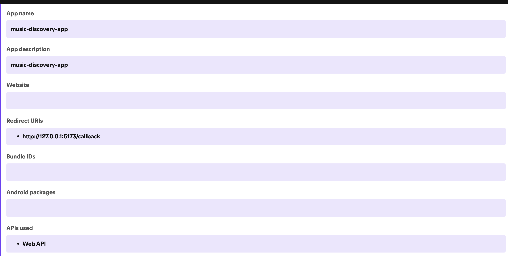

[](https://github.com/alexandre-girard-maif/music-discovery-app-template/actions/workflows/ci.yml) [](https://sonarcloud.io/summary/new_code?id=alexandre-girard-maif_music-discovery-app-template)  [](https://sonarcloud.io/summary/new_code?id=alexandre-girard-maif_music-discovery-app-template)


# Music Discovery App

Application permettant d'intéroger l'API Spotify pour découvrir de la musique en fonction des préférences utilisateur.

- Authentification utilisateur avec Spotify
- Affichage des titres, artistes et playlists favoris

Projet template permettant aux étudiants de faire évoluer l'application en ajoutant des fonctionnalités supplémentaires décrites dans le projet github [music-discovery-app-project](https://github.com/users/alexandre-girard-maif/projects/2/views/8).

Utiliser ce projet `template` afin d'initialiser votre propre projet de découverte musicale avec Spotify, pour cela utilisez le bouton "Use this template" disponible sur la page GitHub de ce dépôt.

Copiez également le projet `music-discovery-app-project` associé à ce template pour suivre les différentes étapes de développement.

## Installation

1. Cloner le dépôt
2. Installer les dépendances
    ```bash
    npm install
    ```
3. Créer un fichier `.env.local` avec vos identifiants API Spotify, vous pouvez vous référer au fichier `.env.sample` pour les variables requises:
    ```env
    VITE_SPOTIFY_CLIENT_ID=YOUR_SPOTIFY_CLIENT_ID
    ```
4. Démarrer le serveur de développement
    ```bash
    npm start
    ``` 
5. Ouvrir votre navigateur et naviguer vers `http://127.0.0.1:5173`

## Utilisation de l'API Spotify

Pour utiliser l'API Spotify, vous devez d'abord créer une application sur le [Tableau de bord des développeurs Spotify](https://developer.spotify.com/dashboard/applications). Une fois l'application créée, vous obtiendrez un `Client ID` et un `Client Secret`. Utilisez ces informations pour configurer votre fichier `.env.local`. Assurez-vous également de définir les URI de redirection appropriés dans les paramètres de votre application Spotify pour permettre l'authentification OAuth.



**Attention:** ne partagez jamais votre `Client Secret` publiquement ou dans votre code source. 

Le fichier `.env.local` est ignoré par Git grâce au fichier `.gitignore`, ce qui aide à protéger vos informations sensibles.

## Modifications des fichiers liés au template

Le fichier `README.md` contient en premières lignes des badges de statut pour le build, la qualité du code et la couverture des tests. Assurez-vous de mettre à jour les liens des badges avec les informations de votre propre dépôt GitHub et de votre projet SonarCloud après avoir cloné le template.

Le fichier `sonar-project.properties` doit également être mis à jour avec les informations de votre projet SonarCloud pour assurer une intégration correcte.

## À propos du projet music-discovery-app-project

Les instructions pour les exercices associés à ce template sont disponibles dans le projet GitHub [music-discovery-app-project](https://github.com/users/alexandre-girard-maif/projects/2/views/8).

Le projet `music-discovery-app-project` contient une liste de tâches que vous devez suivre pour développer et améliorer l'application.

### Tâches et instructions

Chaque tâche est décrite en détail dans le projet GitHub, avec des critères d'acceptation pour vous guider tout au long du processus de développement.

Chaque tâche possède plusieurs propriétés:
- priorité (haute, moyenne, basse)
- étiquette (feature, bug, etc.)
- taille estimée (petite, moyenne, grande) permettant d'évaluer le temps nécessaire pour compléter la tâche.

Le projet contient également un répertoire `instructions` avec des fichiers markdown détaillant chaque étape des exercices à réaliser (même contenu que les tâches GitHub), ainsi que des ressources utiles ou nécessaires pour compléter les tâches. Il contient également des instructions globales à suivre pour toutes les tâches [voir `instruction-global.md`](instructions/instruction-global.md).
